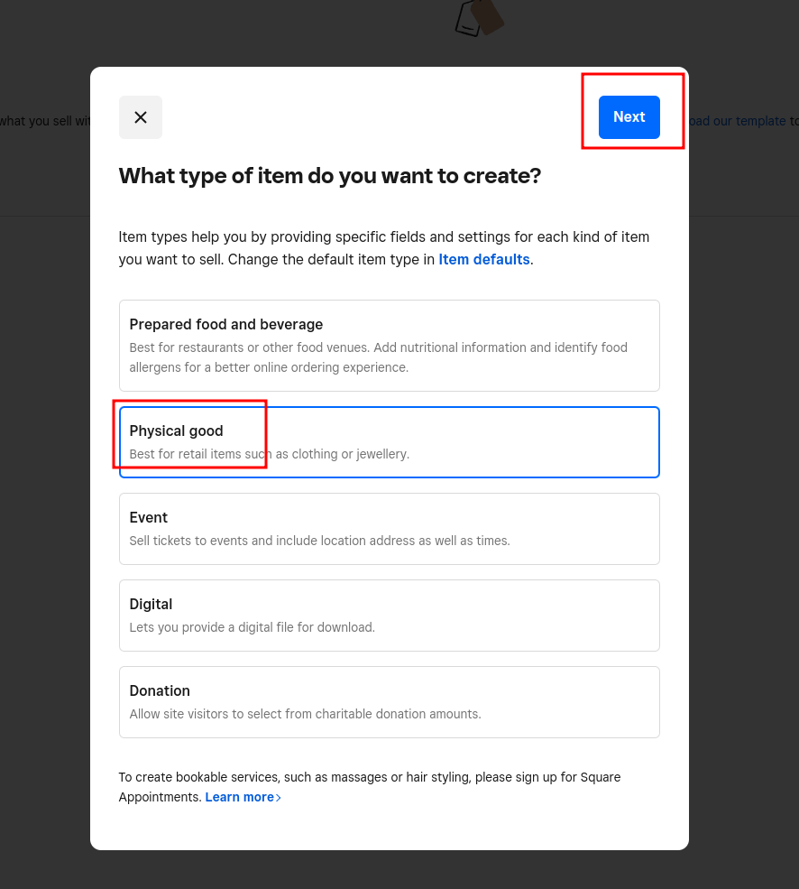

# Start Guide (Real-World Mode)
## Account Setup
To use 'real world-mode' you must setup a Square developer account at:\
https://app.squareup.com/signup/en-US?return_to=https%3A%2F%2Fdeveloper.squareup.com%2Fapps&v=developers \
 \
Setup an application:\
\
Once you've setup your application - we need to create test accounts. Click the back button:

And setup each account you want to test.

Return to your application:

Go to the OAuth Tab:

There you can create tokens for each of your accounts.
## Product Configuration.
On each account you must setup a product- return to the accounts screen:

For each, enter the dashboard and create a product:

Setup physical goods - 
You can leave most of this blank:

Scroll down to 'variations and stock':

And enable tracking:

Save the product:

For each account you will test with record-mode create two products- a calibration item and a tracked item.\
For each polling platform you may create only one.\
<br>
After each account is set up, take their access tokens and run: 
`synchro list <access_token>`
to get the catalog ids of the products.\

<br>
To get the location IDs for each account go to:

<br>
Then, make a `config.json` file in your working directory, and populate it with: 
```json
{
  "RealWorld": {
    "initial_value": 100,
    "platforms": [
      ["VendorA", {
        "Records": {
          "token": "...",
          "backoff": {
            "secs": 0,
            "nanos": 200000000
          },
          "target": ["<location_id>", "<product_id>"],
          "calibration_target": ["<location_id>", "<product_id>"],
        }
      }],
      ["VendorB", {
        "Polling": {
          "token":"...",
          "backoff": {
            "secs": 0,
            "nanos": 200000000
          },
          "target": ["<location_id>", "<product_id>"],
          "interpretation": "Transition" // How to interpret polls- Transition, Mutation, or Assignment
        }
      }]
    ]
  }
}
```
Now you are ready to run- run the command:
`synchro run <your_config_file>`
To test- you will need to open a second incognito window. Login to your developer account again, and go to the accounts page. There you can select a second account simultaneously.\
<br>
You can trigger stock  changes through the manage stock panel as shown previously- changes do not appear in the dashboard until a refresh.\


